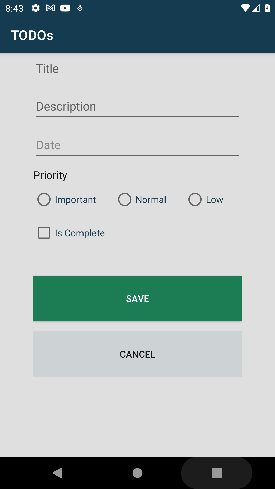

# TodoApp

## Table of contents
* [General info](#general-info)
* [Technologies](#technologies)

## General info
This project is a part of learning course at British College Kathmandu.

Todo App is a final Year Project.

Features of this project are:
* CRUD Operation
* Room Database
* Fragments
* Login / Logout

## Technologies
Project is created with:
* Android Studio
* Java
	
#### Here is the Screenshot for the Todo App which has Features Mentioned Above

| Home |  Add | Exit |
| --------------- | --------------- | --------------- |
|  |  |  |
| Login |  Delete | Blank Home Screen|
|  |  |  |
| Calendar |  Add New | Home Screen |
|  |  |  |
| Update |  Prority Home Screen| Background App |
|  |  |  |
